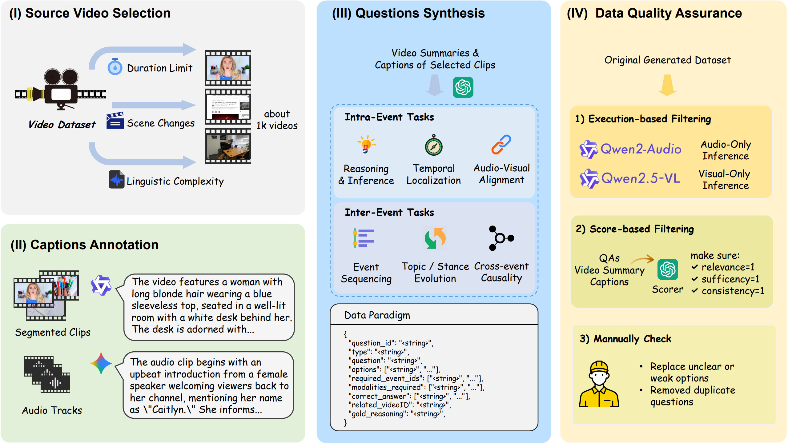

# 🎬 LongInsightBench
This repository accompanies our paper ***LongInsightBench: A Comprehensive Benchmark for Evaluating Omni-Modal Models on Human-Centric Long-Video Understanding***.

It includes the benchmark data, source code for benchmark construction and experiments, as well as experimental results.

<p align="center">

</p>


## 🗂️ Repository Structure

- ```benchmark_qa/```: The main benchmark data.
  - ```qa/```: Full benchmark (used for main experiments), organized into 6 JSON files (one per task).
  - ```qa_subset/```: A 10% random subset of each task (used for ablation studies in the paper’s experiments), also organized into 6 JSON files.

- ```data/```: Intermediate data generated during the benchmark construction process.
  - ```caption_result/```: Visual & audio captions generated by different models.
  - ```event_lists/```: Corresponding ```.json``` files that provide semantic segmentation summaries (an overall video summary, and timestamps & captions of each segment) of each video.
  - ```metadata/```: The original metadata in Finevideo dataset.

- ```src/```: All source code for benchmark construction and experiments.
  - ```ablation_study/```: Runs experiments using single-modal models with caption.
  - ```caption/```: Generates visual and audio captions for each segment based on the segmentation results.
  - ```chunking/```: Performs paragraph-level semantic segmentation of videos.
  - ```evaluation/```: Computes accuracy for model answers.
  - ```qa_check_and_filter/```: Implements a three-step rigorous QA pipeline for quality checking and filtering of generated QA pairs.
  - ```qa_construction/```: Designs QA tasks for six different types.
  - ```test/```: Runs experiments using different models and different settings on the benchmark.
  - ```video_filter/```: Filters the initial video dataset based on duration and content richness.


## ⚙️ Usage

Before running the code, please **modify all input and output paths** in each script according to your local setup.
Use the examples in the source files as references for expected directory structures and file formats.

If you are running model-based experiments, make sure to:
- Set the **model path or API key** in the corresponding scripts.
- Follow the official installation and configuration instructions **from each model’s repository** to prepare the environment.

For experiments in the ```test/``` directory, run either  ```inference/main.py``` (for Ola-7B) or ```main.py``` (for others) after environment setup.


